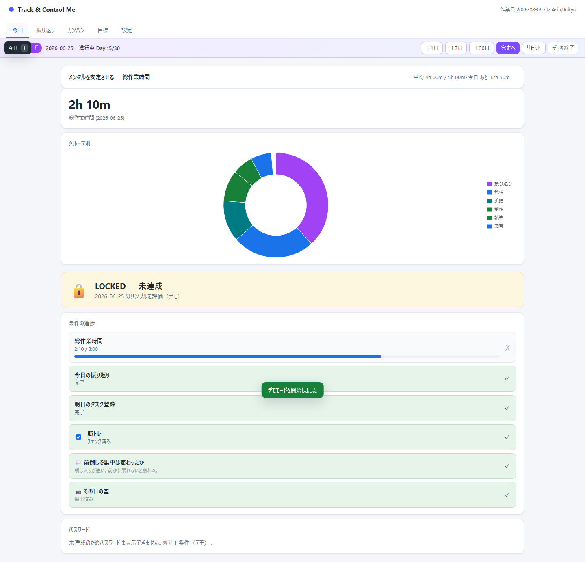
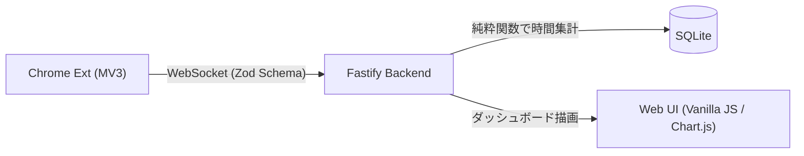

# Track & Control Me

ブラウザのタブグループから作業時間を自動計測し、日次目標の達成時にのみ娯楽PCのパスワードを開示するセルフコントロールツール。

## 開発背景

「作業に集中したいが娯楽の誘惑に負けてしまう」課題に対し、意思の力に頼らず物理的にアクセスを制限する仕組みとして開発。
「開発タブで2時間以上」「総作業時間で4時間以上」といった**カテゴリ別・総時間ごとの柔軟な日次目標**を設定し、すべての条件を満たすまで外部PCのパスワード開示をブロックします。

## アーキテクチャ & 技術スタック

Chrome拡張機能（MV3）とローカルサーバー（Fastify）の連携構成。
`packages/contract` を通じて拡張機能・サーバー間で Zod スキーマおよび TypeScript 型定義を共有しています。

| コンポーネント | 技術スタック / 役割 |
|---|---|
| `extension` | **Chrome MV3 (TypeScript / esbuild)** アクティブなタブグループを検出・WebSocket送信 |
| `server` | **Fastify 5 / Node.js 22 / SQLite (better-sqlite3)** 時間集計（divide-by-N）、ルール評価、ダッシュボード描画 |
| `packages/contract` | **Zod / TypeScript** 拡張・サーバー間のデータ通信プロトコル共有 |

