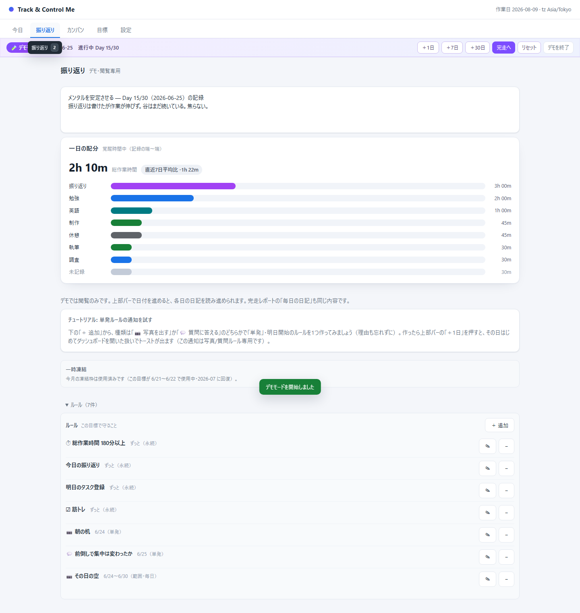
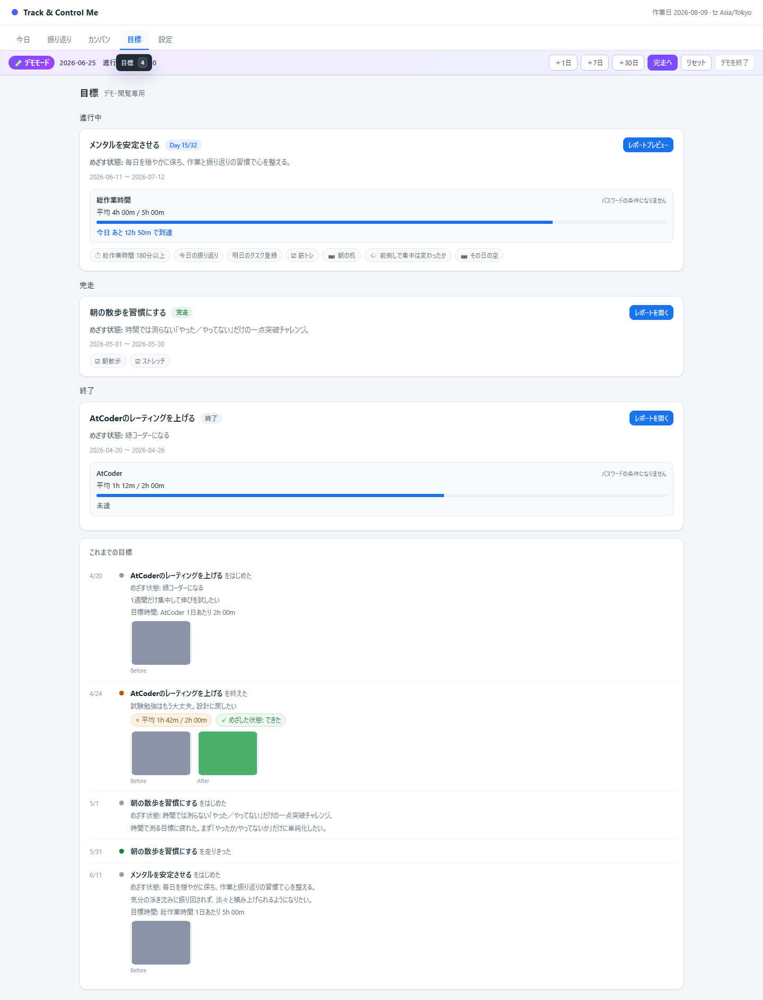
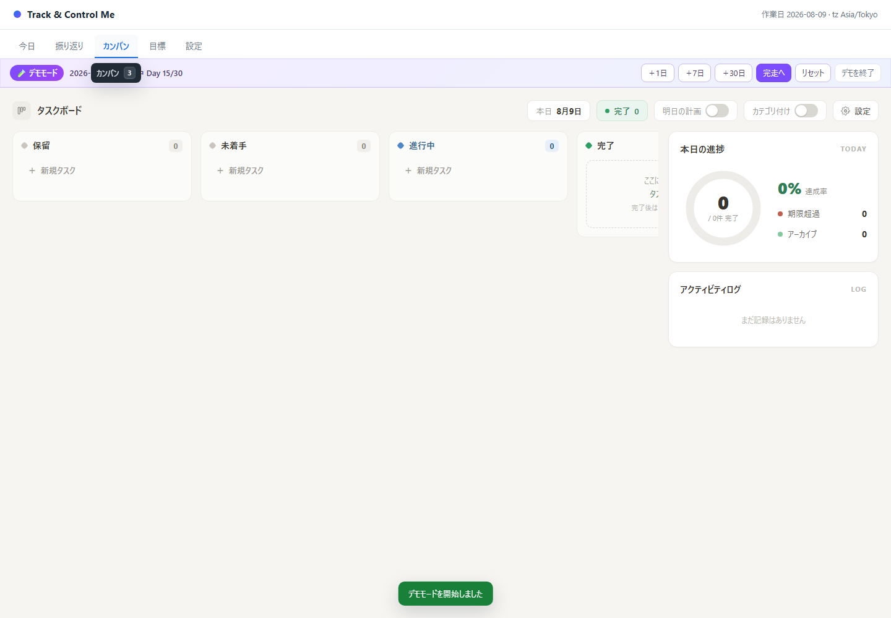
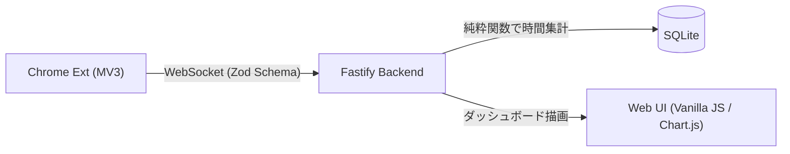

# Track & Control Me

ブラウザのタブグループから作業時間を自動計測し、日次目標の達成時にのみ娯楽PCのパスワードを開示するセルフコントロールツール。


## 開発背景

「作業に集中したいが娯楽の誘惑に負けてしまう」課題に対し、意思の力に頼らず物理的にアクセスを制限する仕組みとして開発。
「開発タブで2時間以上」「総作業時間で4時間以上」といった**カテゴリ別・総時間ごとの柔軟な日次目標**を設定し、すべての条件を満たすまで外部PCのパスワード開示をブロックします。

## 主な画面機能

| 今日（ダッシュボード） | 振り返り（分析 & タイムライン） |
|---|---|
|  |  |

| 目標管理 | カンバンボード |
|---|---|
|  |  |

## アーキテクチャ & 技術スタック

Chrome拡張機能（MV3）とローカルサーバー（Fastify）の連携構成。
`packages/contract` を通じて拡張機能・サーバー間で Zod スキーマおよび TypeScript 型定義を共有しています。

| コンポーネント      | 技術スタック / 役割                                                                                             |
| ------------------- | --------------------------------------------------------------------------------------------------------------- |
| `extension`         | **Chrome MV3 (TypeScript / esbuild)**<br>アクティブなタブグループを検出・WebSocket送信                          |
| `server`            | **Fastify 5 / Node.js 22 / SQLite (better-sqlite3)**<br>時間集計（divide-by-N）、ルール評価、ダッシュボード描画 |
| `packages/contract` | **Zod / TypeScript**<br>拡張・サーバー間のデータ通信プロトコル共有                                              |



## セットアップ & 使い方

特別な専門知識がなくても、以下のステップでローカル環境に導入して利用できます。

### 1. 必要な準備（事前準備）

* **Node.js**: v22 以上（[Node.js 公式サイト](https://nodejs.org/)から入手可能）
  * ターミナル等で `node -v` と入力してバージョンが表示されれば準備完了です。
* **ブラウザ**: Google Chrome、Microsoft Edge、または Brave（Chromium 系ブラウザに対応）

### 2. プロジェクトの取得とビルド

ターミナル（Windowsの場合は PowerShell やコマンドプロンプトなど）を開き、順番にコマンドを入力します。

```bash
# 1. リポジトリのクローン（またはダウンロード）
git clone https://github.com/Fujita0113/track-and-control-me.git
cd track-and-control-me

# 2. 必要なパッケージのインストール
npm install

# 3. ブラウザ拡張機能のビルド
npm run build:ext
```

### 3. ローカルサーバーの起動

集計処理やダッシュボード機能を提供するサーバーを起動します。

```bash
npm run server
```

起動後、ブラウザで **[http://localhost:47653](http://localhost:47653)** にアクセスすると、ダッシュボード画面が開きます。
※既定ポートは `47653` です（使用中の場合は自動的に空きポートへ割り当てられます。ターミナルに表示される `Server listening at ...` のURLをご確認ください）。

### 4. ブラウザ拡張機能の読み込み

1. **拡張機能ページを開く**: お使いのブラウザのアドレスバーに以下を入力して開きます。
   * Chrome の場合: `chrome://extensions`
   * Edge の場合: `edge://extensions`
   * Brave の場合: `brave://extensions`
2. **デベロッパーモードの有効化**: ページ内にある「デベロッパー モード」のスイッチをオンにします。
3. **拡張機能の読み込み**: 「パッケージ化されていない拡張機能を読み込む」（Edge では「展開して読み込み」）ボタンをクリックします。
4. **フォルダの選択**: 本プロジェクト内の `extension/dist` フォルダを選択します。

### 5. 基本的な使い方

1. **タブグループの作成**: ブラウザのタブを右クリックして「新しいグループにタブを追加」を選択し、カテゴリ名（例: 「開発」「勉強」など）を付けて作業を開始します。
2. **自動計測の確認**: ブラウザ拡張機能がアクティブなタブグループの滞在時間を検知し、ローカルサーバーへ自動送信します。
3. **達成度とパスワードの確認**: `http://localhost:47653` で日次の作業進捗を確認できます。事前に設定した日次目標をすべて達成すると、ロックされていたパスワードが開示されます。