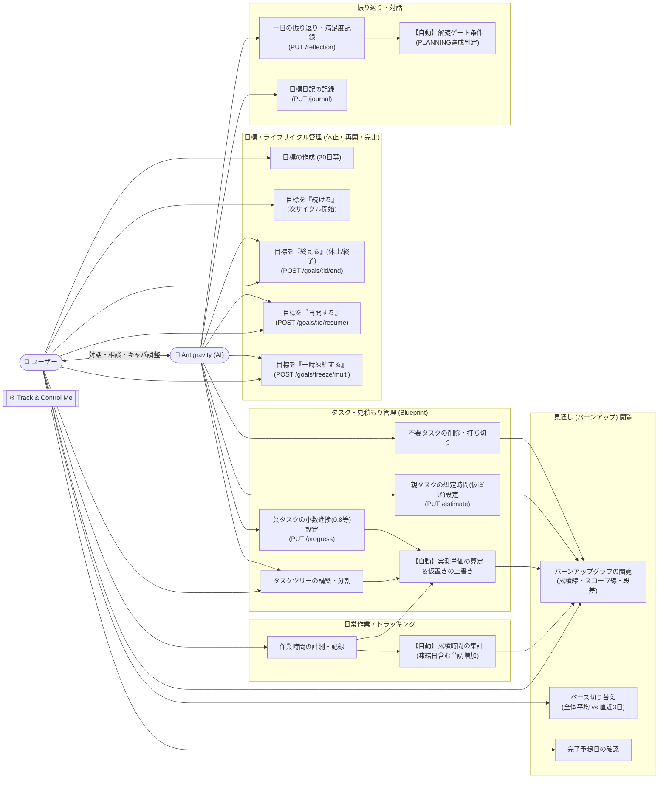

# 目標バーンアップ見通し・タスク見積もり ユースケース図 (Use Case Specification)

本ドキュメントは、目標の見通し（バーンアップ）・タスク見積もり・日々の振り返り・ライフサイクル操作における「ユーザー」「Antigravity (AIエージェント)」「システム（Track & Control Me）」の責務とユースケースをまとめたものです。

---

## 1. 全体ユースケース図 (Mermaid)

---

## 2. ユースケース詳細と責務一覧

### ① 目標・ライフサイクル管理 (キャパ調整・終了・再開)
- **目標作成**: ユーザーが30日チャレンジなどの目標と生活ルールを設定。
- **目標を『終える』（休止 / 終了） (`POST /api/goals/:id/end`)**: 
  - ユーザーまたは **Antigravity** が理由つきで実行。
  - 抱えきれなくなった目標を休止し、翌日からパスワード解錠ゲートの永続ルールを解除する。
- **目標を『再開する』 (`POST /api/goals/:id/resume`)**: 
  - ユーザーまたは **Antigravity** が理由つきで実行。
  - 余裕ができたタイミングで以前終了した目標を翌日から再開し、ルールを復帰させる。
- **目標を『一時凍結する』 (`POST /api/goals/freeze/multi`)**:
  - 当日夜のノルマのみを一時的に凍結（月1枠の緊急枠）。
- **完走時のフォーク**: 目標カード上で直接「続ける」（新サイクル開始）または「終える」を選択。

### ② タスク・見積もり管理 (Blueprint & task-estimate)
- **タスクツリー構築**: ユーザーとAntigravityが相談し、大枠フェーズ（根直下）と詳細タスクを組み立てる。
- **想定時間の設定 (`PUT /estimate`)**: Antigravityが合議に基づき親タスクへ想定秒数を設定。
- **小数の進捗 (`PUT /progress`)**: 「タスク完了には至らないが8割進んだ」等の進捗をAntigravityが登録。
- **単価の自動改善**: 走行中の枝でタスクを消化すると、システムが自動で実測単価（時間/消化量）を導出し、残り想定時間を更新。

### ③ 日常作業・トラッキング
- **時間計測**: ユーザーが作業を行い、システムが累積時間を単調増加で蓄積（凍結日も0hとしてカウント）。

### ④ 振り返り・対話
- **一日の振り返り (`PUT /reflection`)**: Antigravityが対話内容から振り返りテキストと満足度をAPI送信。システムは自動で翌朝のパスワード解錠条件（PLANNING）を満たす。
- **目標日記 (`PUT /goals/:id/journal`)**: 目標ごとの気付きやメモを記録。

### ⑤ 見通し（バーンアップ）閲覧
- **見通し確認**: ユーザーが目標カードの「見通し」からインラインSVGグラフを開く。
- **2本のペース切り替え**: 「全体平均ペース」「直近3日ペース」を切り替え、完了予想日が手前にジャンプする様子を確認。
- **段差の理由確認**: スコープ線の段差から「○月○日: Antigravityが想定時間を削減」「○月○日: タスクを削除」といった履歴を閲覧。
